덱빌딩 스무고개 - AI 이미지 작업 후기
===
# 캐릭터 컨셉
## 프롬프트
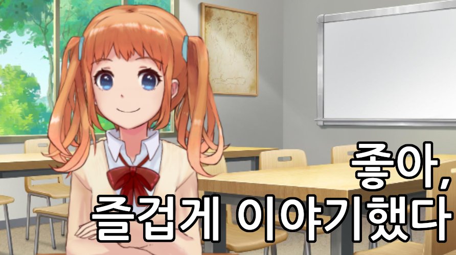{: width="50%"}  
위와 같은 전작의 캐릭터와 되도록이면 같은 캐릭터로 인식될 수 있도록 특징이 되는 프롬프트 선정
* medium hair, twintails, orange hair, hair ribbon
* blue eyes
* school uniform, yellow cardigan
## 모델
* 모델: [KayWaii](https://civitai.com/models/88184)
* Lora: [Maplestory style](https://civitai.com/models/14313)

# 스탠딩 일러스트 제작 과정
## 문제 1: 캐릭터 체형
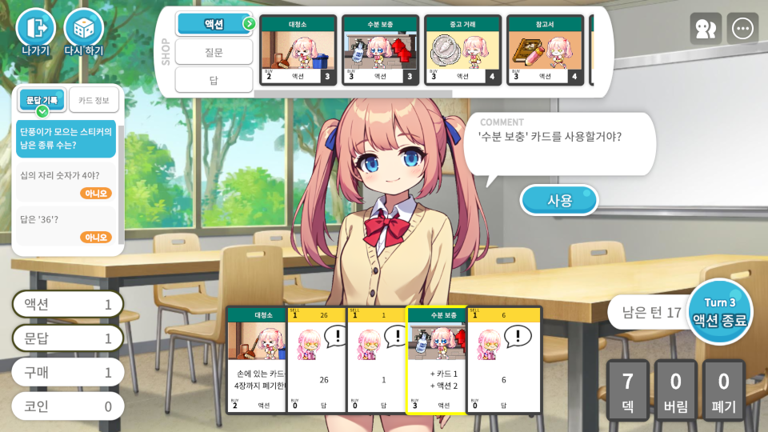  
만들려는 게임에는 위와 같이 화면 하단을 가리는 UI가 있어, 캐릭터의 상체를 보여주려면 등신비가 커야 함.  

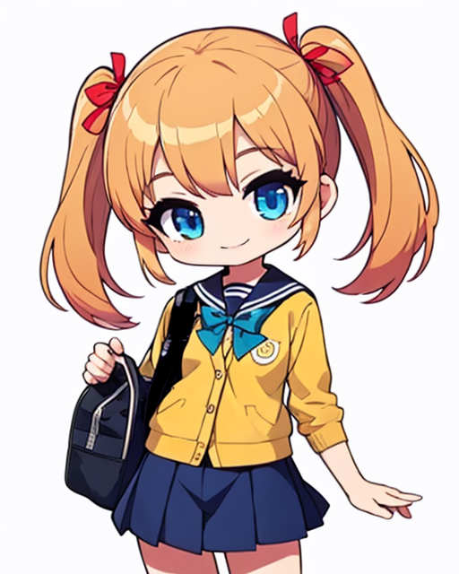{: width="50%"}  
하지만 메이플스토리 Lora 적용 시 위와 같이 SD 체형 캐릭터가 생성됨. (512 x 640)  

| {: width="50%"} | 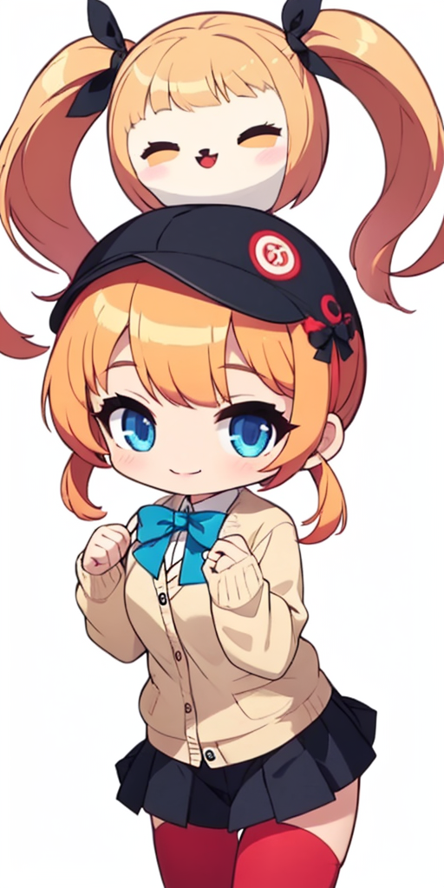{: width="50%"} |
| --- | --- |

이미지의 세로 길이를 늘려봐도(512 x 1024) 등신비는 그대로이거나, 빈 공간에 엉뚱한 이미지가 채워지는 경우가 많았음.

## 문제 1 대응: Controlnet OpenPose 사용
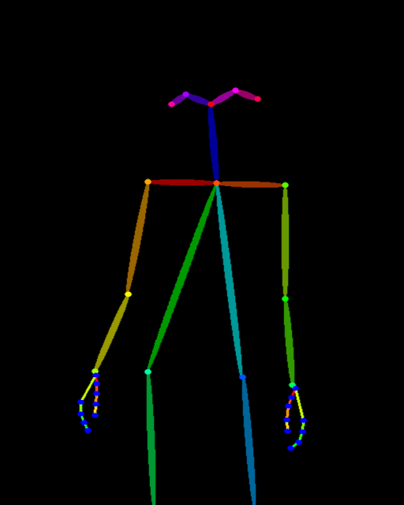{: width="50%"}  
[[OpenPose] Standing](https://civitai.com/models/128029/openpose-standing) 에서 구한 OpenPose 이미지를 사용하는 것으로 생성되는 캐릭터 이미지의 체형을 제어할 수 있었음.

## 문제 2: 전체가 마음에 드는 이미지가 나오지 않음
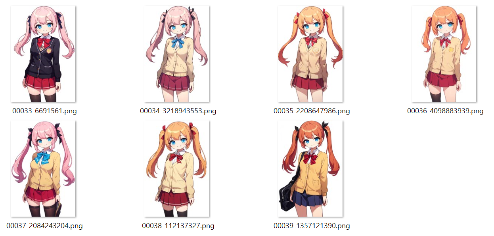  
위와 같이 이미지 생성을 반복해봤지만 전체가 마음에 드는 이미지가 나오지 않았음.  
* 머리카락이 주황색이었으면 했지만 orange hair, brown hair 를 지정해도 원하는 색깔이 나오지 않음.
* 어떤 이미지든 복상의 모양이나 색이 원하지 않는 형태인 부분이 포함되어 있음.
  
Inpaint 로 일부만 바꿔본다 해도 다른 이미지에서의 마음에 들었던 형태로는 나오지 않거나, 나머지 부분과 자연스럽게 이어지지 않는 경우가 많았음.

## 문제 2 대응: 이미지 편집 툴로 짜집기

| 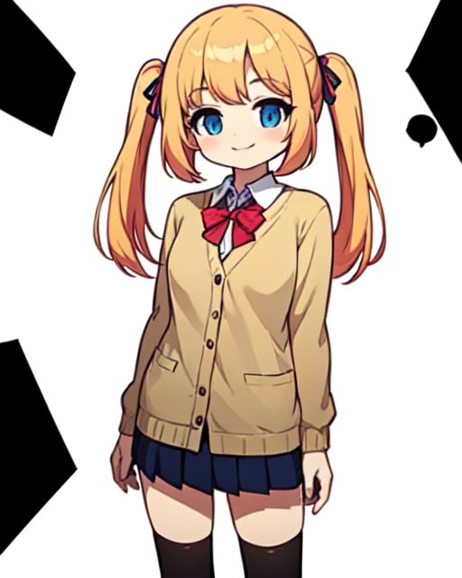 | 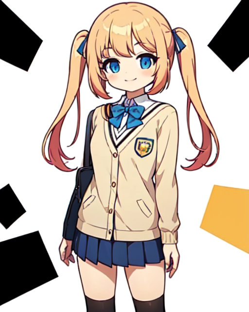 |
| --- | --- |
| 교복을 차용할 이미지 | 머리 리본을 차용할 이미지 |

우선 생성된 이미지 중 의도한 것과 일치하는 부분을 가진 이미지들을 모음.  

| 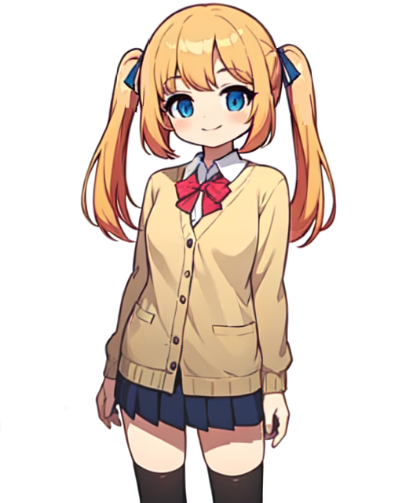 | 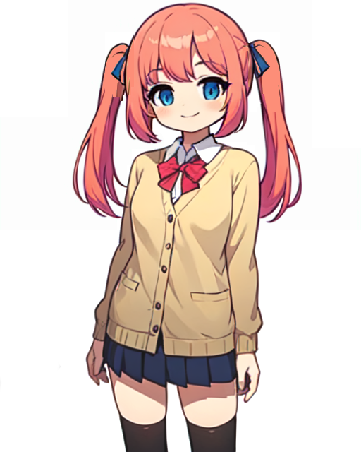 |
| --- | --- |
| 합쳐진 이미지 | 머리 색상 보정 |

이미지 편집 툴로 필요한 부분들을 합치고, 원하는 색상으로 보정하여 밑그림을 만듦.  
  
{: width="50%"}  
이렇게 준비된 밑그림을 img2img 로 크기를 늘려 기준이 되는 스탠딩 일러스트 생성함.

## 표정 변경

| {: width="50%"} | 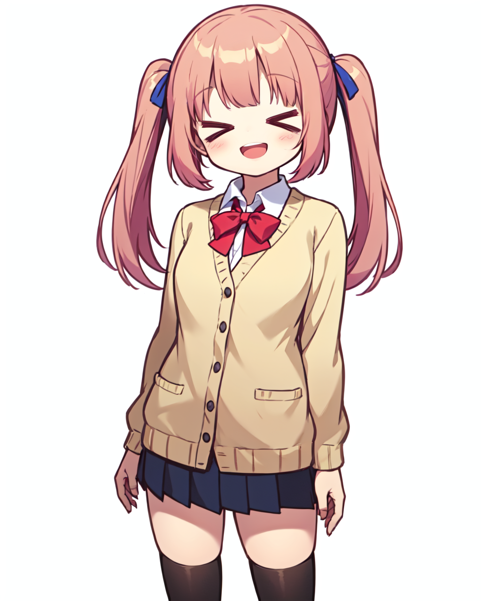{: width="50%"} |
| --- | --- |

기준 스탠딩 일러스트에서 표정 관련 프롬프트를 바꿔가며 얼굴 부분을 inpaint 함.  
  
스탠딩 일러스트들을 자세히 보면 표정 뿐만 아니라 앞머리도 조금씩 바뀌는데, 이는 앞머리까지 inpaint 영역에 포함되었기 때문.  
  
XD 표정은 해당 표정 만들어주는 Lora 사용([Comic expression eyes 1](https://civitai.com/models/134236)). 메이플스토리 Lora 비중을 낮춰야 표정 Lora 가 제대로 적용됐음.