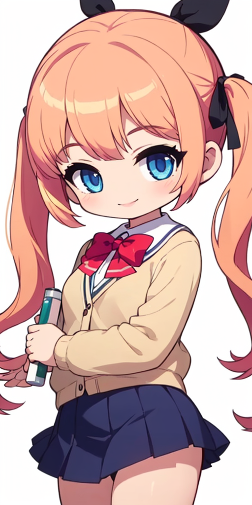

덱빌딩 스무고개 - AI 이미지 작업 후기
===
# 캐릭터 컨셉
## 프롬프트
{: width="75%"}  
위와 같은 전작의 캐릭터와 되도록이면 같은 캐릭터로 인식될 수 있도록 특징이 되는 프롬프트 선정
* medium hair, twintails, orange hair, hair ribbon
* blue eyes
* school uniform, yellow cardigan
## 모델
* 모델: [KayWaii](https://civitai.com/models/88184)
* Lora: [Maplestory style](https://civitai.com/models/14313)

# 스탠딩 일러스트 제작 과정
## 문제 1: 캐릭터 체형
{: width="75%"}  
만들려는 게임에는 위와 같이 화면 하단을 가리는 UI가 있어, 캐릭터의 상체를 보여주려면 등신비가 커야 함.  

{: width="50%"}  
하지만 메이플스토리 Lora 적용 시 위와 같이 SD 체형 캐릭터가 생성됨. (512 x 640)  

| --- | --- |
| {: width="75%"} | {: width="75%"} |

이미지의 세로 길이를 늘려봐도 등신비는 그대로이거나, 빈 공간에 엉뚱한 이미지가 채워지는 경우가 많았음.

## 문제 1 대응: ControlNet OpenPose 사용
{: width="50%"}  
[[OpenPose] Standing](https://civitai.com/models/128029/openpose-standing) 에서 구한 OpenPose 이미지를 ControlNet에 사용하는 것으로 생성되는 캐릭터 이미지의 체형을 제어할 수 있었음.

## 문제 2: 전체가 마음에 드는 이미지가 나오지 않음
  
위와 같이 이미지 생성을 반복해봤지만 전체가 마음에 드는 이미지가 나오지 않았음.  
* 머리카락이 주황색이었으면 했지만 orange hair, brown hair 를 지정해도 원하는 색깔이 나오지 않음.
* 어떤 이미지든 복상의 모양이나 색이 원하지 않는 형태인 부분이 포함되어 있음.
  
Inpaint 로 일부만 바꿔본다 해도 다른 이미지에서의 마음에 들었던 형태로는 나오지 않거나, 나머지 부분과 자연스럽게 이어지지 않는 경우가 많았음.

## 문제 2 대응: 이미지 편집 툴로 수정

| --- | --- |
| {: width="75%"} | {: width="75%"} |
| 교복을 차용할 이미지 | 머리 리본을 차용할 이미지 |

우선 생성된 이미지 중 의도한 것과 일치하는 부분을 가진 이미지들을 모음.  

| --- | --- |
| {: width="75%"} | {: width="75%"} |
| 합쳐진 이미지 | 머리 색상 보정 |

이미지 편집 툴로 필요한 부분들을 합치고, 원하는 색상으로 보정하여 밑그림을 만듦.  
  
{: width="75%"}  
이렇게 준비된 밑그림을 img2img 로 크기를 늘려 기준이 되는 스탠딩 일러스트 생성함.

## 표정 변경

| --- | --- |
| {: width="75%"} | {: width="75%"} |
| Surprised | XD |

기준 스탠딩 일러스트에서 표정 관련 프롬프트를 바꿔가며 얼굴 부분을 inpaint 함.  
  
스탠딩 일러스트들을 자세히 보면 표정 뿐만 아니라 앞머리도 조금씩 바뀌는데, 이는 앞머리까지 inpaint 영역에 포함되었기 때문.  
  
XD 표정은 해당 표정 만들어주는 Lora 사용([Comic expression eyes 1](https://civitai.com/models/134236)). 메이플스토리 Lora 비중을 낮춰야 표정 Lora 가 제대로 적용됐음.

# 타이틀 일러스트 제작 과정

{: width="75%"}  
Openpose 로 캐릭터 구도를 잡음.  

{: width="75%"}  
적당한 배경 구도가 나올 때 까지 이미지 생성을 반복.  

{: width="75%"}  
{: width="75%"}  
배경으로부터 mlsd 추출, 이미지 편집 프로그램으로 끊어진 부분 수정.  

| 이미지 | 살릴 부분 |
| --- | --- |
| {: width="75%"} | 배경 상체 |
| {: width="75%"} | 책상 목 리본 |

OpenPose + mlsd 로 생성한 이미지들.  
mlsd에서 선으로 채워지지 않은 곳에 불필요하게 얼굴이 추가된 약혐(...) 이미지가 생성됨.  
각 이미지에서 살릴 부분을 합치고, 어색한 부분은 덧칠하여 가림

{: width="75%"}  
완성본

# 작업 후기
## 반복 작업의 효율화
원하는 이미지, 또는 영감을 주는 이미지가 나올 때 까지의 반복을 얼마나 효율적으로 할 수 있는지가 중요

### 처리 시간
* 좋은 머신을 사용할수록 작업 시간을 절대적으로 줄일 수 있음
* 개발 PC 사양
  * Intel(R) Core(TM) i7-6700 CPU @ 3.40GHz, 4 코어, 8 스레드
  * NVIDIA GeForce GTX 1070, VRAM 8GB
* 이미지 생성 소요시간
  * 512 x 640, 8 Step: 수 초
  * 512 x 640, 20 Step: 십여 초
  * 1920 x 1080, 20 Step: 1시간 이상
* 시간 절약을 위해 작은 크기, 적은 Step 수로 구도를 먼저 파악하고 Step 수와 크기를 늘려가며 작업했지만, 저퀄리티 버전에서 마음에 들었던 이미지와 차이가 발생.
  * 처음부터 높은 Step 수의 이미지를 빠르게 뽑아 판단할 수 있었다면 작업 시간 많이 단축됐을 것.

### 원하는 이미지가 나올 확률 높이기
* 원하는 이미지가 나올 수 있도록 범위를 좁히는 기술이 필요함
* 예시
  * 캐릭터: Lora 학습
  * 포즈: [DesignDoll](https://terawell.net/en/)로 포징, OpenPose 로 뽑아내기
  * 배경: [SketchUp](https://www.sketchup.com/en)으로 배경 공간 모델링, mlsd 로 뽑아내기
* 물론 Lora 학습 재료가 될 캐릭터 이미지를 만들어 낼 수 있었다면 AI를 안썼겠지만...
* 위와 같이 범위를 좁혀 대량의 이미지를 빠르게 뽑아낼 수 있는 환경을 만들면 베스트일 듯

### 사람의 후처리
* AI가 100% 완전한 그림을 만들어 줄 수도 있겠지만 그러기에는 너무나 많은 시간과 비용 들어감
* AI가 그려주는 그림은 70% 정도의 완성도에서 타협, 나머지 30%는 사람이 후처리하는 식의 접근이 좋을 것 같음

## 퀄리티 문제
### 상품 가치
* 생성된 이미지를 보면서 계속 들었던 의문
  * 유저가 돈을 내고 살 마음이 드는 그림인가?
  * 내 이름을 걸고 만드는 게임에 넣어도 괜찮은 그림인가?
  * 소규모 게임이니 망정이지, 어설픈 이미지는 대기업 게임에서 쓰기에는 확실히 무리가 있음
* 각 프로젝트가 처한 상황이나 AI 이미지를 사용하는 목적에 따라 잘 판단해야 될 듯 함

### 작품성
* 타이틀 일러스트의 경우, "캐릭터가 책상에 앉아있다"는 정보는 전달되지만 재미나 감성이 부족함
* 감정을 불러일으킬 수 있는 그림을 만들기 위해서는 AI를 사용하더라도 역시 사람의 미술적 능력이 필요함
  * 포즈, 구도, 광원, 색감 등

## 결론 - 결국은 사람이다

{: width="50%"}  

* 타이틀 일러스트를 만들던 도중에 나온 아쉬운 이미지
* 무작위 딸깍 딸깍을 반복하다 보면 재미있는 구도의 그림이 나올 수도 있지만, 프롬프트나 이미지 크기를 바꾸다보면 또 느낌이 달라짐
* 원하는 느낌을 설계하고, 의도적으로 뽑아낼 수 있도록 하는 사람의 능력이 중요해 보임